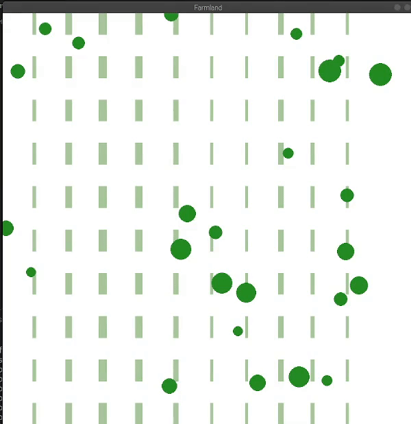
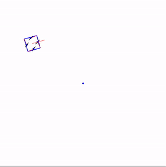

# RBE 550 Project

## Multi-layer Path Planning for Autonomous Unmanned Ground Vehicle for Weeding Applications

*Aadiv Shah and Antoinette Mavrotheris*

  

### Environment Generation

### Robot Modelling

  

### A* Algorithm

### Travelling Salesman Problem